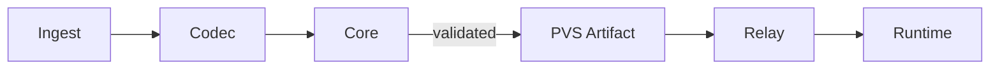

> This article describes a concrete architectural position that is fully implemented and mechanically enforced in code.
> - The implementation lives at: [Github](https://github.com/fabian4/pavis)
> - The architectural constraints and invariants referenced here are defined and governed in: [ARCHITECTURE.md](https://github.com/fabian4/pavis/blob/main/ARCHITECTURE.md)
> 
> Pavis is an experimental project. The data-plane semantics and Frozen Data Plane model are stable; the control plane and ecosystem integrations are still evolving.


## When Complexity Is Made Safer by Intelligence

Over the past decade, infrastructure design has been moving in one clear direction: make systems smarter in order to make increasingly complex systems safer to operate.

- We introduced Kubernetes to manage fleets of unstable processes.  
- We introduced service meshes to manage unpredictable application behavior.  
- We introduced adaptive retries, rate limits, and circuit breakers to smooth out volatile production realities.  
- We even introduced chaos engineering to deliberately train systems to survive their own failure modes.

The underlying assumption is consistent:

> when a system becomes too complex to reason about statically, the only viable response is to add runtime intelligence.

This has undeniably made many systems more resilient.

It has also normalized an idea: that it is acceptable to defer semantic ambiguity and semantic responsibility until runtime, as long as we have something smart enough to deal with it later.

This project started from a recurring pattern observed across proxy systems.

Most L7 proxies behave reasonably well at steady state. Where things consistently become fragile is during **change**: reloads, rollbacks, and recovery after sustained stress.

In those moments, the runtime is expected to do too much. It interprets configuration, reconciles partial state, and makes best-effort decisions while traffic is still flowing.

> Over time, I stopped believing that reload paths should be “smart” at all.  
> **If a system needs intelligence during reload, it is already too late.**

This led to a different question:

**What would it take to keep the runtime intentionally non-interpreting — even during reload, rollback, and recovery?**

Not limited, but *non-interpreting*. A process that executes a fully specified plan, and refuses to guess when that plan is incomplete.

## What a Dumb Runtime Means

In this context, **“dumb” does not mean incapable**.

It means **non-interpreting**:

- The runtime executes a fully specified execution plan
- It refuses to infer, reconcile, or extrapolate beyond it

Once the runtime is allowed to think, it is implicitly allowed to **rewrite the configuration** it was given.

Pavis is built to prevent that.

## The Constraint That Makes a Dumb Runtime Necessary

Once you commit to keeping the runtime non-interpreting, many design choices stop being optional.

A dumb proxy:

- cannot infer defaults
- cannot reconcile incomplete configuration
- cannot “learn” what it should have been told explicitly

Configuration must therefore be **complete, explicit, and internally consistent _before_ it ever reaches the runtime**.

This constraint leads directly to the idea of a **Frozen Data Plane** — not as a feature, but as a consequence.

> If the runtime is not allowed to think, all semantic work has to happen earlier.

This is not a stylistic preference.

If the runtime is not allowed to resolve ambiguity, then ambiguity must be eliminated earlier. There is no third place for it to go.

The Frozen Data Plane is not a feature choice. It is a conservation law.

## Freezing Execution, Not Intent

In Pavis, freezing does **not** happen at the YAML or API boundary. It happens at the **execution boundary**.

Conceptually, the pipeline looks like this:

> intent → resolution → validation → serialization → execution

Source intent is parsed, defaults are resolved, references are bound, semantic invariants are validated, and the result is serialized into a binary artifact. **Only then** does the runtime see anything.

What gets frozen is **not configuration text**, but **execution state**. By the time the runtime sees an artifact, there are no remaining decisions to make.

## Resolving Ambiguity Before Runtime

Consider a simple timeout field:

```yaml
route:
  timeout: null
```

In Pavis, ambiguity is resolved *before* runtime. During compilation, the Codec materializes this into an explicit value:

```rust
// Materialized during compilation
RuntimeRoute {
    timeout_ms: 0, // no runtime inference
}
```

The runtime never interprets `null`, defaults, or intent.  
It only executes the value it is given.

The same principle applies to more complex, execution-affecting constructs.

> The performance benefit is not an optimization.  
> It is a consequence of refusing to defer execution semantics until runtime.

## Where the Runtime Boundary Is Drawn

Keeping the runtime dumb requires **strict separation of responsibility**.



Each arrow represents a **one-way authority boundary**. Semantics move strictly left to right. Nothing downstream reinterprets upstream decisions.

- **Ingest** accepts external intent
- **Codec** compiles intent into an explicit internal model
- **Core** enforces environment-independent invariants
- **Relay** distributes opaque, versioned artifacts
- **Runtime** executes exactly what it is given

> In many systems, parts of this semantic binding are deferred to reload time.  
> That is precisely the behavior Pavis is designed to make impossible.

Every boundary exists to protect the same invariant:

**The runtime remains non-interpreting.**

## Reaction, Not Learning

This is where the design line becomes sharp.

> **Reaction** is state that expires with the condition.  
> **Learning** is state that survives it.

Pavis allows the runtime to **react**, but not to **learn**.

Reaction protects the system in the moment:

- fail-fast behavior
- rejection under pressure
- fixed-parameter rate limiting

This state is short-lived and scoped. It does not redefine future behavior.

Learning is different. Failure history becomes routing input. Latency samples reshape load distribution. Adaptive parameters outlive the conditions that produced them.

Once that happens, the runtime is no longer just executing configuration — it is **implicitly rewriting it**.

Envoy and Linkerd make different, intentional trade-offs here:

- **Envoy** promotes observed failure history into routing decisions via outlier detection
- **Linkerd** reshapes routing continuously through EWMA latency tracking

These designs aim to smooth instability and improve steady-state efficiency.

The difference is not correctness. It is **where responsibility is placed**.

Pavis draws the line earlier.

Once learned state participates in routing or policy, rollback is no longer a reference switch. It becomes a partial unlearning problem.

At that point, configuration is no longer the sole source of truth.

## Why Reload and Rollback Become Boring

Once execution is frozen and the runtime is constrained, configuration change becomes mechanically simple.

- **Reload** is a reference switch
- **Rollback** is the same switch in reverse
- There is no separate rollback mechanism

```rust
// Pseudo-code: atomic artifact swap
let current = ArcSwap<RuntimeState>;

fn reload(new_artifact: RuntimeArtifact) {
let next = RuntimeState::from(new_artifact);
current.store(Arc::new(next)); // no merge, no transition
}
```

There is **no rollback code path**. There cannot be one.

Rollback is a pointer move, not a recovery algorithm.

Recovery after stress is not a configuration action. The active artifact remains unchanged. As load subsides, request- and connection-scoped state drains naturally.

> Recovery is not a phase.  
> It is the absence of pressure.

## Consequences of a Dumb Runtime

Freezing execution has concrete engineering effects.

- Binary artifacts compress well and distribute predictably
- They can be checksummed, audited, and replayed locally
- The same artifact can be inspected offline without a running system

Because configuration is explicit and versioned, tooling such as `pavctl` can reason about behavior **without querying runtime state**.

Because the runtime is non-interpreting, the `.pvs` artifact is the sole source of behavioral truth. If you can audit the artifact, you have audited the live system.

There is no hidden policy state, no emergent routing behavior, and no decision-making surface that exists only at runtime.

In systems like Envoy, live behavior is a function of:

> configuration × runtime state × learned history

That product is not auditable in any strict sense. It can only be observed.

In Pavis, behavior is a pure function of a versioned, checksummed artifact. That makes security review, forensic analysis, and compliance verification mechanically possible.

Using Rust and Pingora reinforces this model: ownership is explicit, lifetimes are bounded, and hot reload is an atomic state swap rather than incremental mutation.

None of these are goals by themselves. They are consequences of removing interpretation from the runtime.

## Configuration Drift and GitOps Semantics

This also eliminates an entire class of problems: configuration drift.

In most smart proxies, live behavior is not identical to the configuration stored in Git.

It is a composite of:
- the declared configuration,
- runtime-internal state,
- and historical adaptation.

Over time, these diverge.

At that point, Git no longer describes what the system is doing. It only describes what the system once intended to do.

In Pavis, there is no such drift.

The artifact *is* the configuration. The runtime has no writable policy state.

If the artifact matches what was produced by your GitOps pipeline, then the live system is, by construction, in sync with Git.

For operators and controllers, this collapses reconciliation to a checksum comparison.

## Extensibility Without Runtime Complexity

Freezing the data plane does not mean freezing integration.

New ecosystems integrate through **Codec** and **Ingest**. xDS is treated as an *input language*, not a runtime contract.

As long as intent can be compiled into the same explicit model and validated by Core, it can be executed by the same runtime unchanged.

> The proxy does not learn new rules.  
> The ecosystem adapts to the frozen execution model.

## Project Status

Pavis is not production-ready.

The Frozen Data Plane model, artifact semantics, and runtime invariants described in this article are stable and heavily exercised by end-to-end tests.

The control plane, management APIs, and ecosystem integrations (e.g. xDS, Kubernetes CRDs) are still under active development and may change substantially.

## The Deliberate Trade-off

This design deliberately gives up adaptive behaviors that many operators now consider table stakes.

It will not gradually learn its way into a better equilibrium under prolonged stress. In return:

- configuration semantics remain explicit and inspectable
- reload and rollback behavior stays mechanical
- recovery does not depend on unwinding learned state

This is not a universal solution.

It deliberately optimizes for reload determinism, auditability, and semantic locality at the explicit cost of long-horizon adaptivity.

That trade-off is not accidental. It is the point.

## Conclusion

Pavis is an experiment in refusing to make the runtime smart.

By freezing execution and pushing complexity earlier, it trades flexibility for clarity: reload becomes boring, rollback becomes trivial, recovery becomes predictable.

A runtime that never interprets configuration also never compiles regexes, resolves defaults, or reconciles partial state. Boring reloads are the most visible consequence of that boundary.

> In a world of increasingly smart infrastructure, Pavis is built on the assumption that the safest component is the one that knows exactly what to do—and nothing more.
